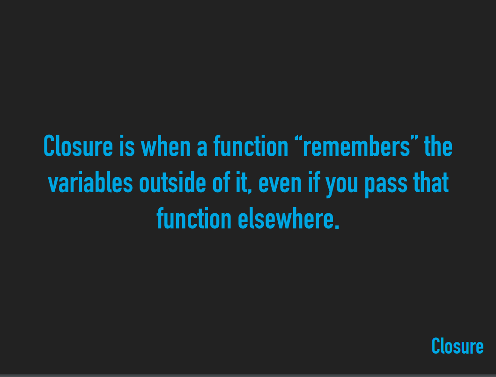

# Java Script Guide

## Learning resources:

[https://javascript.info/](https://javascript.info/)

[https://developer.mozilla.org/en-US/docs/Web/JavaScript/A_re-introduction_to_JavaScript](https://developer.mozilla.org/en-US/docs/Web/JavaScript/A_re-introduction_to_JavaScript)

W JavaScriptcie wszystko jest obiektem.

Przekazywanie odbywa się zawsze poprzez referencje, nie jak ma to miejsce w Javie poprzez wartość.

Warto zauważyć, że nawet Array stanowi obiekt, a wywołanie array[1] stanowi właściwie odniesienie się do property  "1" 

Czyli tak reprezentacja takiej tablicy może wyglądać 

```jsx
var array = {
	"name": "hello",
	"0": 1,
	"1": 1,
  "2": 2.
}

array.name // hello
array[1] // 1
array[2] // 2
```

Równie poprawnym w JSie będzie odnoszenie się do property danego obiektu poprzez bracketsy, tzn:

```jsx
var array = {
	"name": "hello"
};

array["name"]; // hello

array["surname"] = "world";//It's okey, it will be still working!

```

Zwrócić uwagę warto także, że w JS **. (dot)** możemy zastąpić **[ ] (brackets)**  jednak ze względu na wygądę w 90% przypadków używamy . (dot) 

### == vs. ===

Allows coercion | Disallows coercion! (type check)

If variable is implicitly declared like in this  example "topic", 

the scope of this var will be global, because the default variable declaration is "var" which provides global scope for declared variable .

```jsx
var teacher  = "Kyle";

function scope() {
  teacher = "Suzy";
  topic = "React";
  console.log("Wtf?");
}

scope();

console.log(teacher);
console.log(topic);
```

### Block scoping:

```jsx

//Block scoping 
var teacher = "Kyle";

{
  let teacher = "Suzy"; // let scope is only in curly brackets
  console.log(teacher);
}

console.log(teacher);
```

```jsx
function varScope() {
  var value = 5;  // in this example var is only available in varScope function 
}

```

### Clousure:



Closure występuje w miejscu, w którym funkcja potrafi zapamiętać zmienną z zewnątrz nawet jeśli, jest ona przekazana gdzie indziej. Przykładem tego może być:


myQuestion wciąż będzie pamiętać, wartość parametru question przekazanego w linii 7.

Więc w tym przypadku wywołanie w linii jedynastej wciąż będzie powodować zalogowanie w konsoli ciągu znakowego **"What is closure?"**

### more about Closure:


### this:


this odnosi się do kontekstu, w którym zostało wywołane i jest od niego w pełni zależne.


funkcje tzw. this aware mogą mieć za każdym razem inną wartość, w zależności od kontekstu, w którym zostały wywołane.


wywołując funkcje poprzez  metode **call(myContext, value)** precyzujemy, w jakim kontekście ma byc wywołana dana metooda (w powyzszym przypadku metoda **ask(question)**)

### Prototype:


funkcja Workshop w inii 1 i 2 w tym przypadku będzie stanowić coś co w świecie Javy, no i od pewnego czasu ECMAScript 6 nazywamy konstruktorem. 

Wywołaniem Workshop.prototype.ask przypisujemy niejako metodę do naszej pseudo klasy Workshop.

W powyższy sposób tworzone są klasy w JavaScriptcie u podstaw, taka właśnie mechanika stoi za keywordem class w JS.

### this - implicit binding:

kropka wskazuje nam context na jaki wskazuje this.


*sharing contexts*

### this - explicit binding:

### Class:


Deklarowanie zmiennych:

```jsx
const [first, second] = [true, false];// first == true, second == false
let [first, second] = [true, false];// first == true, second == false
var [first, second] = [true, false];//first == true, second == false

var [first, second];
[first, second] = [true, false];//first == true, second == false

//That declaration is the same as:
var first = true;//false
var second = false;//true
```

Deklarowanie obiektów: 

```jsx
const {first, second} = {first: 0, second: 1};
let {first, second} = {first: 0, second: 1};
var {first, second} = {first: 0, second: 1};

{first, second} = {first: 0, second:1}
```

Dekonstrukcja wartości:

```jsx
const {name, weapon, room} = {
"name": "Rusty", 
"room": "kitchen",
"weapon": "candlestick" 
}
name // "Rusty"
weapon //"candestick"
room //"kitchen"
```

# Operacje na listach:

Akumulacja wartości:

```jsx
var [a, ...b] = [1, 2, 3]; // 1, [2, 3]
```

Swap/Zamiana

```jsx
var a = 1, b = 2;
[b, a] = [a, b]; //2,1 
```

Looping:

```jsx
// standard for loop
for (let i = 0; i < array.length; i++) {
		array[i];
}

// loop over each property in object
// it could be tricky, we don't use it with array
for (let key in obj) {
		obj[key];
}

// loop over each element of array 
for (let element of array) {
	 //do whateva you want with element
}
```

Pamiętajmy, że for-of działa nie tylko z tablicami, ale także z obiektami takimi jak **Stringi**, czy też  DOM NodeLists, **Mapami i Setami**

[https://developer.mozilla.org/en-US/docs/Web/API/NodeList](https://developer.mozilla.org/en-US/docs/Web/API/NodeList)

_.**each()/.forEach():**


w JS możemy wykorzystać metody _.each(...) z biblioteki underscorejs oraz natywne .forEach(...) do iteracji.

**_.map()/.map():**


Główna różnica między each, a map jest, taka, że funkcja **each()** nie zwraca żadnej wartości w przeciwieństwie do **map()**

```jsx
var weapons = ["knife", "gun", "sword"];
var brokeWeapon = function(weapon) {
	return `${weapon} is broke`; 
}

weapons.map(weapons, brokeWeapon): 
```

**.filter();**


# Anatomia funkcji:


## Arrow Functions 🏹:


Funkcje strzałkowe(arrow functions) w przeciwieństwie do klaycznych funkcji zawsze odnoszą się(binding) do kontekstu rodzica (parent context)

P.S Funkcje także są obiektami i możemy dodać im odpowiednie property

```jsx
const add = function(a, b) {
	return a + b;
};
add.example = 'testing123!';
```

**arguments** keyword:


arguments mówi nami jakie i ile ekstra argumentów zostało przesłane.

Przykład dla arrow function:

```jsx
const createTuple = (...arguments) => {
  console.log(arguments);
};

createTuple('It', 'be', 'could', 'anyone', 'no one');
```

Aczkolwiek, jest to w pewien sposób naciągane 😆

**WAŻNE!**

> Arrow functions do not have an arguments binding. However, they have access to the arguments object of the closest non-arrow parent function. Named and rest parameters are heavily relied upon to capture the arguments passed to arrow functions.

Odpowiedź na pytanie czy potrzebujemy używać *return przy arrow functions:*

Implicit return, but only if there is no block.

- This will result in errors when a one-liner expands to multiple lines and the programmer forgets to add a `return`.

Typowym sposobem użycia ***arguments*:** 


### Parametry domyślne:


tutaj należy zauważyć, że *console.log(arguments) zaloguje nam tylko [3],* dlatego, że logujemy parametry.

The old way:

```jsx
**const add = (a, b) => {
  b = b || 2; // it's return 2 if b doesn't exists :) 
  return a + b;
}

add(3); //5**
```

**join():**

```jsx
//1st
const constructorArray = function() {
  const arr = Array.prototype.slice.call(arguments); //can be replaced by Array.from(arguments);
  arr.push('the billiards room?');
  return arr.join(' ');
};
var wasit = constructorArray('was', 'it', 'in'); //was it in the billiards room?

//2nd
const constructorArray = function() {
  const arr = Array.from(arguments);
  arr.push('the billiards room?');
  return arr.join(' ');
};
var wasit = constructorArray('was', 'it', 'in'); //was it in the billiards room?
```

**NodeJS, inicjalizacja projektu**: 
*npm init*  [i](//inicjalizacja)nicjalizacja tworzy plik package.json
*npm install eslint* instalacja modułu eslint(lokalnie)
*./node_modules/.bin/eslint --init* utworzenie pliku .eslintrc.json

opcjonalnie:
*npm install underscore* instalacja modułu undescore z utilities

import modułu do pliku js:
*const _ = require('underscore');* 

# Scope:

# Callbacks:


 **

### Callback vs. Closure

```jsx
var fn = function (val) {
  console.log(`We are calling ${val}`)
  return function holdYourValue() {
    console.log(`This is now ${val}`)
  };
};

var callCallback = (value) => value('callback!'); 
callCallback(fn); //We are calling callback!

var closure = fn('closure!'); //
closure(); //It's remember a value passed a line above, result: We are calling closure!
           //                                                   This is now closure!
```

 

**var args:**

Aby przekazać tablice z argumentami używamy *...val* val oczywiście może być dowolną zmienną. 

```jsx
const multiArgs = function(arg1, ...args) {
  console.log(`Call multi args function ${arg1} \n`);
  console.log(isArray(args));
  for (val of args) {
    console.log(val);
  }
};

multiArgs('one', 'two', 'extra three', 'extra four');

//result:
//Call multi args function one

//true
//two
//extra three
//extra four
```

**reduce**`_.reduce(list, iteratee, [memo], [context])` *Aliases: **inject**, **foldl***Also known as **inject** and **foldl**, reduce boils down a **list** of values into a single value. **Memo** is the initial state of the reduction, and each successive step of it should be returned by **iteratee**. The iteratee is passed four arguments: the memo, then the value and index (or key) of the iteration, and finally a reference to the entire list.

If no memo is passed to the initial invocation of reduce, the iteratee is not invoked on the first element of the list. The first element is instead passed as the memo in the invocation of the iteratee on the next element in the list.

```jsx
var sum = _.reduce([1, 2, 3], function(memo, num){ return memo + num; }, 0);
=> 6
```

# undefined vs. undeclared

**undefined -** variable is declared but have never been initialized   

**undeclared** - variable is not declared at all 

```jsx
//example 1.
typeof v; //undeclared

//example 2.
var v; 
typeof v; //undefined
```

# typeof

```jsx
typeof null; //"object"
typeof array[]; //"object"
typeof v; //"undeclared"

var v;
typeof v; //"undefined"
var f = function f();
typeof f; //"function"
```

# primitive types


### NaN

NaN is not equals NaN. This is a special case. 

```jsx
NaN === NaN // false
```


## Negative Zero


## Fundamentals Objects:

*Najczęściej stosowane


## **Koercja typów**

Nie działa jednak kompletnie chaotycznie, chociaż na pierwszy rzut oka może się tak wydawać. Proces zmiany typu parametru nazywany jest koercją typów. Trudne słowo, które ma proste znaczenie: zmiana typu wartości na inny typ.

W podwójnym operatorze zmiana tych typów następuje wg ściśle określonych 10 króków:

1. Jeśli oba parametry są tego samego typu porównaj je jeszcze raz potrójnym operatorem  **… === …**
2. Jeśli pierwszy jest null a drugi undefined, zwróć **true**. To trzeba zapamiętać.
3. Odwrotność drugiego. Pierwszy to undefined, drugi null. Jak można się domyśleć, także zwróci **true**.
4. Jeśli pierwszy jest number a drugi string. **Stara się zmienić tekst na liczb**ę (w poprzednim akapicie wspomniałem jak można to zrobić). **Następnie powtarza wszystkie kroki od początku.**
5. Odwrotność czwartego. Czyli pierwszy to string a drugi number. **Zmienia typ stringu na number i powtarza wszystkie kroki**.
6. Jeśli pierwszy jest boolen a drugi czymkolwiek. **Stara się zmienić boolean na number i powtarza wszystkie krok**i (*Number(true) = 1, Number(false) = 0*).
7. Odwrotność szóstego.
8. Jeśli pierwszy jest wartością prymitywną (string, number, symbol) a drugi obiektem. **Stara się zmienic obiekt to wartości prymitywnej i powtarza wszystkie kroki**. Jak zmenić
9. Odwrotność ósmego.
10. Jeżeli żaden z poprzednich punktów nie jest naszym przypadkiem, zwóć **false**.

Powyższe 10 kroków to jedna iteracja, czyli jedno powtórzenie. Tych powtórzeń będzie tyle, aż w końcu dostaniemy **true** albo **false**. Ot, cała magia.

**== vs. ===**


# Hoisting

W JavaScript wszystkie deklaracje zmiennych i funkcji są przenoszone na początek kodu! (Windowane)